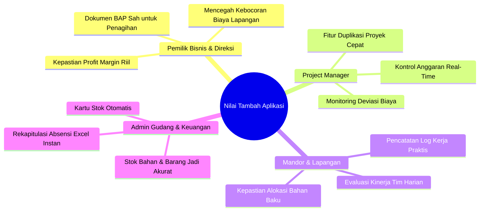

# 🚀 Keunggulan & Nilai Strategis Aplikasi
## Sistem Manajemen HPP, Manufaktur & Log Kinerja Lapangan

Dokumen ini menguraikan keunggulan kompetitif, diferensiasi fitur, serta nilai tambah (*business value*) dari **Sistem HPP & Manufaktur** ini dibandingkan metode pencatatan manual (spreadsheet konvensional) maupun software ERP generik.

---

## 🌟 Ringkasan Eksekutif (*Executive Summary*)

Aplikasi ini dirancang khusus untuk memecahkan tantangan terbesar pada industri manufaktur, fabrikasi *custom*, dan kontraktor produksi: **kesenjangan antara apa yang direncanakan di atas kertas (anggaran HPP) dengan apa yang benar-benar terjadi di lantai produksi (realisasi lapangan)**.

Dengan memadukan modul **Perancangan Resep BOM Bertingkat**, **Pencatatan Log Kinerja Karyawan**, **Otomasi Pergudangan**, dan **Analisis Deviasi Margin Real-Time**, sistem ini menghadirkan kontrol finansial dan operasional yang presisi tanpa birokrasi yang rumit.

---

## 🏆 10 Keunggulan Utama Aplikasi

### 1. Integrasi Penuh: Standard Costing vs Actual Costing
* **Masalah Umum**: Sering kali estimasi penawaran harga (*quotation*) dibuat di Excel, sementara kuitansi pengeluaran dicatat terpisah di buku kasir. Manajemen baru menyadari proyek merugi setelah proyek selesai.
* **Solusi Aplikasi**:
  - Menyandingkan **Estimasi HPP** dan **Realisasi HPP Riil** secara berdampingan pada satu layar terpadu.
  - Menghitung **Deviasi Biaya (*Cost Variance*)** secara otomatis per komponen (Bahan Baku, Tenaga Kerja, Overhead).
  - Indikator warna dinamis memberi peringatan dini (*early warning*) jika ada pos biaya yang mendekati atau melampaui anggaran rancangan (*overbudget*).

---

### 2. Hierarchical Bill of Materials (BOM) & Multi-Level Sub-Assembly
* **Masalah Umum**: Sebagian besar sistem sederhana hanya mendukung daftar bahan datar (*flat BOM*), tidak mampu menggambarkan produk yang terdiri dari beberapa modul perakitan.
* **Solusi Aplikasi**:
  - Mendukung struktur pohon perakitan berjenjang (*tree-based parent-child hierarchy*) tanpa batas kedalaman.
  - Memisahkan secara jelas antara *Material Mentah* (mengambil stok gudang) dan *Sub-Assembly* (rakitan internal).
  - Tampilan visual indentasi pohon perakitan memudahkan engineer memahami urutan proses perakitan.

---

### 3. Fitur Cerdas: "Salin BOM dari Proyek Lain" dengan Multiplier
* **Masalah Umum**: Menginput ulang puluhan atau ratusan komponen resep BOM untuk pesanan produk yang serupa sangat memakan waktu dan rawan salah ketik (*human error*).
* **Solusi Aplikasi**:
  - Fitur duplikasi instan yang menyalin seluruh resep BOM, anggaran tenaga kerja, overhead, dan barang jadi dari proyek masa lalu.
  - **Dukungan Faktor Pengali (*Multiplier Qty*)**: Pesanan 2x atau 5x lipat lebih banyak cukup diisi pada kolom pengali; seluruh kuantitas komponen langsung dihitung ulang otomatis.
  - **Integritas Pohon Perakitan Terjaga 100%**: Algoritma kloning berjenjang (*2-pass cloning*) memastikan relasi induk-anak pada sub-assembly tetap terhubung dengan benar pada proyek baru.

---

### 4. Jembatan Mandor-Kantor: Log Kinerja Terhubung ke Realisasi Proyek
* **Masalah Umum**: Jam kerja tukang dan mandor di lapangan sering dicatat di secarik kertas, menyulitkan alokasi biaya tenaga kerja langsung ke nomor proyek yang bersangkutan.
* **Solusi Aplikasi**:
  - Menu **Log Kinerja & Kegiatan** memungkinkan mandor/staf mencatat aktivitas fisik harian (jam mulai, jam selesai, output kerja, dan satuan hasil).
  - Fitur **Posting ke Realisasi Proyek**: Satu klik langsung mengonversi catatan kerja harian menjadi biaya riil tenaga kerja di proyek tujuan tanpa entri ulang.
  - **Fleksibel**: Dapat dipasangkan ke anggaran Tenaga Kerja yang sudah direncanakan (*planned*), atau dibiarkan tanpa pasangan jika merupakan pekerjaan tambahan darurat di lapangan (*unplanned work*).

---

### 5. Otomasi Gudang Terpadu & Pemotongan Stok Dua Arah
* **Masalah Umum**: Petugas gudang dan tim proyek sering tidak sinkron, menyebabkan saldo fisik persediaan di gudang berbeda dengan catatan sistem.
* **Solusi Aplikasi**:
  - **Pemotongan Stok Otomatis (Mutasi OUT)**: Setiap pemakaian bahan baku (**Realisasi BOM**) maupun pemakaian barang jadi pendukung yang dipasang ke proyek (**Realisasi Barang Jadi**) langsung memotong saldo persediaan gudang secara *real-time*.
  - **Validasi Stok Fisik**: Sistem memvalidasi ketersediaan stok sebelum mencatat realisasi pemakaian untuk mencegah saldo minus fiktif.
  - **Penambahan Stok Hasil Proyek (Mutasi IN)**: Saat proyek selesai (*Closing Proyek*), tersedia opsi otomatis untuk memasukkan output fisik barang jadi ke gudang.
  - **Buku Kartu Stok Kronologis Otomatis**: Melacak histori keluar-masuk setiap material dan barang jadi lengkap dengan referensi nomor proyek secara transparan.

---

### 6. Dukungan Multi-Satuan Konversi (*Unit Conversion*)
* **Masalah Umum**: Bahan dibeli dalam satuan besar (misal: *Dus*, *Rim*, *Roll*, *Kaleng Besar*), namun di lantai produksi dipakai dalam satuan kecil (misal: *Pcs*, *Lembar*, *Meter*, *Kg*).
* **Solusi Aplikasi**:
  - Sistem mendukung pendaftaran satuan beli dan satuan pakai dengan penetapan rasio konversi otomatis.
  - Menghindari kesalahan perhitungan harga pokok akibat perbedaan satuan transaksi.

---

### 7. Penguncian Data Audit (*Audit Lock*) & Berita Acara Penyelesaian (BAP)
* **Masalah Umum**: Proyek yang sudah selesai rawan diubah datanya secara diam-diam oleh oknum, merusak laporan keuangan bulanan.
* **Solusi Aplikasi**:
  - Saat status berubah menjadi **Selesai (Completed)**, seluruh formulir HPP, BOM, dan transaksi realisasi dikunci secara permanen (*read-only*).
  - Menghasilkan dokumen resmi **Berita Acara Penyelesaian (BAP)** siap cetak (printer-friendly / PDF) lengkap dengan kolom tanda tangan sah: *Customer*, *Pimpinan Proyek*, dan *Bagian QC/Gudang*.
  - **Mekanisme Reopen Aman**: Jika pembukaan kembali terpaksa dilakukan karena audit khusus, sistem mewajibkan pengisian alasan audit dan secara otomatis melakukan **rollback mutasi stok gudang** agar kuantitas fisik tidak ganda.

---

### 8. Keamanan Data & Validasi Ketat (*Safety Guardrails*)
* **Masalah Umum**: Data proyek penting atau karyawan terhapus secara tidak sengaja karena tidak ada batasan sistem.
* **Solusi Aplikasi**:
  - **Safeguard Hapus Proyek**: Proyek yang sudah berjalan (`in_progress` / `completed`) atau yang sudah memiliki riwayat pemakaian bahan/stok ditolak mutlak dari penghapusan. Hanya proyek Draft bersih yang diizinkan dihapus.
  - **Safeguard Karyawan**: Karyawan yang memiliki rekam jejak pada log kinerja dilindungi dari penghapusan agar tidak merusak data histori realisasi masa lalu.
  - **Proteksi HTTP**: Seluruh aksi penghapusan diamankan menggunakan metode `POST` dengan enkripsi token `CSRF`.

---

### 9. Master Customer Interaktif dengan Riwayat Portofolio
* **Masalah Umum**: Mengetahui riwayat pesanan seorang klien biasanya membutuhkan pencarian manual di banyak tabel transaksi.
* **Solusi Aplikasi**:
  - Tabel Master Customer dilengkapi tombol interaktif **Badge Proyek (`X Project`)**.
  - Sekali klik membuka modal riwayat proyek yang menampilkan seluruh proyek klien tersebut, status kemajuan, akumulasi total nilai kontrak (format Rupiah), dan tautan langsung ke detail proyek.

---

### 10. Antarmuka Cepat, Responsif & Tanpa Reload Berlebih
* **Masalah Umum**: Aplikasi web enterprise sering kali lambat, kaku, dan memerlukan reload halaman penuh setiap kali memilih dropdown.
* **Solusi Aplikasi**:
  - Menggabungkan ketangguhan arsitektur backend **Django** dengan kelincahan reaktif **Alpine.js**.
  - Menggunakan komponen autocomplete combobox, modal pop-up instan, dan kalkulasi dinamis di sisi klien.
  - Desain modern berbasis *Tailwind CSS* dengan hierarki visual yang jelas, tipografi nyaman, dan warna badge status yang intuitif.

---

## 📊 Matriks Perbandingan: Metode Konvensional vs Aplikasi HPP

| Parameter Evaluasi | Spreadsheet Manual (Excel) | Software ERP Raksasa (SAP/Odoo Generik) | Aplikasi HPP & Manufaktur Ini |
| :--- | :--- | :--- | :--- |
| **Kecepatan Implementasi** | Cepat, tetapi cepat berantakan | Sangat lama (3-12 bulan implementasi) | **Sangat cepat, langsung siap pakai** |
| **Konektivitas Lapangan** | Tidak ada (harus salin manual) | Kaku & memerlukan lisensi per pengguna mahal | **Mudah diakses via browser oleh mandor** |
| **Pohon Sub-Assembly** | Rumit dibuat dengan rumus cell | Ada, tetapi konfigurasi sangat rumit | **Intuitif, visual, dan mendukung duplikasi** |
| **Otomasi Pemotongan Stok** | Manual (rawan selisih kuantitas) | Ada (modul terpisah) | **Otomatis terpotong saat realisasi BOM** |
| **Log Kinerja ke Realisasi** | Tidak terhubung | Butuh custom programming | **Terintegrasi secara langsung (*1-click post*)** |
| **Penguncian Audit (Closing)** | Tidak ada proteksi cell yang aman | Ada | **Otomatis dikunci saat closing + BAP cetak** |
| **Biaya Kepemilikan (TCO)** | Murah di awal, mahal di kesalahan | Sangat mahal (biaya server & konsultan) | **Sangat efisien dan terjangkau** |

---

## 💼 Manfaat Nyata bagi Pemangku Kepentingan (*Business Impact*)

1. **Bagi Pemilik Bisnis & Direktur**:
   - Menghilangkan *blind spot* keuangan: mengetahui profit riil per proyek secara presisi sebelum proyek diserahterimakan.
   - Menghentikan pemborosan material dan upah kerja terselubung.
2. **Bagi Project Manager & Estimator**:
   - Memangkas waktu pembuatan anggaran penawaran hingga 70% berkat fitur Salin BOM.
   - Memiliki kendali penuh terhadap deviasi biaya di setiap tahap pengerjaan.
3. **Bagi Tim Produksi & Mandor**:
   - Menghubungkan jerih payah kerja harian tim dengan pencapaian proyek nyata.
   - Transparansi ketersediaan bahan baku di gudang sebelum memulai pengerjaan fisik.
4. **Bagi Bagian Gudang & Logistik**:
   - Tidak ada lagi selisih antara saldo komputer dan fisik berkat pemotongan stok otomatis dan kartu stok real-time.

---

## 🎯 Kesimpulan

Aplikasi ini bukan sekadar software pencatatan, melainkan **alat kendali operasional dan profitabilitas manufaktur**. Dengan menempatkan HPP sebagai pusat dari seluruh alur kerja—mulai dari penawaran, pengadaan bahan, penugasan karyawan, hingga penyerahan barang jadi—perusahaan dapat beroperasi lebih efisien, terhindar dari kebocoran biaya, dan meningkatkan margin keuntungan secara konsisten.
