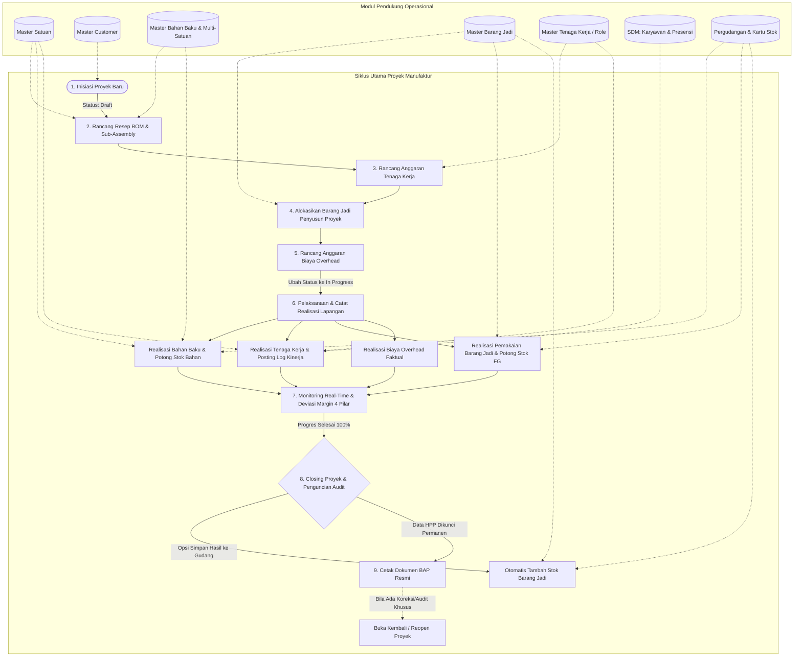

# 🧭 Panduan Alur Pengguna (User Journey)
## Sistem Manajemen HPP, Manufaktur & Log Kinerja Lapangan

Dokumen ini memetakan seluruh perjalanan pengguna (*user journey*) dalam mengoperasikan sistem manufaktur, perancangan Harga Pokok Produksi (HPP), pencatatan realisasi lapangan, hingga modul-modul operasional pendukung.

---

## 🗺️ Peta Alur Utama (End-to-End Flowchart)

---

## 📌 BAGIAN I: SIKLUS UTAMA PROYEK (CORE MANUFACTURING LIFECYCLE)

Alur ini dijalankan untuk setiap pesanan manufaktur, *custom fabrication*, atau proyek produksi baru.

---

### Tahap 1: Inisiasi & Pembuatan Proyek Baru (`Draft`)
* **Menu**: `Project & HPP` -> `Buat Project Baru` (`/projects/new/`) atau via tombol header di `Daftar Project`.
* **Aktor**: *Sales Estimator / Project Manager*
* **Langkah-langkah**:
  1. Klik tombol **Buat Project Baru**.
  2. Isi identitas proyek:
     - **Kode Proyek**: Masukkan kode unik (misal: `PRJ-202609-001`) atau gunakan penomoran standar.
     - **Nama Proyek**: Nama pesanan produk (misal: *"Meja Rapat Kayu Jati Solid 4x2m"*).
     - **Pilih Customer**: Pilih dari data *Master Customer* yang sudah terdaftar, atau ketik nama customer langsung.
     - **Tanggal Mulai & Target Selesai**: Tentukan estimasi jadwal produksi.
     - **Nilai Kontrak (Rp)**: Masukkan harga jual kesepakatan dengan customer (tanpa tanda Rp/titik, sistem memformat otomatis).
     - **Catatan / Spesifikasi**: Rincian teknis pesanan khusus klien.
  3. Status awal proyek otomatis bernilai **`Draft / Perencanaan`**.
  4. Simpan proyek. Sistem akan mengarahkan ke halaman **Detail Proyek / Rancang HPP**.

> [!TIP]
> **Opsi Hapus Proyek Draft**:
> Jika ada kesalahan pembuatan proyek di awal sebelum produksi dimulai, proyek draft dapat dihapus dengan aman melalui tombol **Hapus Draft** di header detail atau daftar proyek (hanya tersedia jika belum ada transaksi realisasi/mutasi persediaan).

---

### Tahap 2: Perancangan Struktur Resep / Bill of Materials (BOM) & Sub-Assembly
* **Menu**: Halaman `Detail Project` -> Tab `Daftar Bahan & Sub-Assembly (BOM)`
* **Aktor**: *Estimator / Engineer Produksi*
* **Langkah-langkah**:
  1. **Menambah Item BOM Manual**:
     - Klik tombol **`+ Tambah Item BOM`**.
     - Pilih **Tipe Komponen**:
       - *Material / Bahan Mentah*: Bahan baku yang diambil dari gudang (pilih dari pencarian dropdown Master Bahan Baku, harga satuan otomatis terisi sesuai harga beli terakhir).
       - *Sub-Assembly Rakitan*: Modul setengah jadi yang dirakit di pabrik (misal: *"Rangka Kaki Besi"*, *"Daun Meja Laminated"*).
     - Masukkan kuantitas estimasi dan satuan.
     - Jika komponen merupakan bagian dari rakitan lain, pilih **Parent Sub-Assembly** untuk membentuk hierarki pohon perakitan berjenjang (*assembly tree*).
  2. **Memanfaatkan Fitur Duplikasi Cepat ("Salin BOM dari Proyek Lain")**:
     - Jika ada pesanan serupa dengan proyek yang pernah dibuat sebelumnya, klik **`Salin BOM dari Proyek Lain`**.
     - Cari dan pilih proyek sumber.
     - Amati kotak pratinjau jumlah komponen (BOM, Tenaga Kerja, Overhead, Barang Jadi).
     - Centang komponen yang ingin disalin.
     - Tentukan **Faktor Pengali (*Multiplier Qty*)**, misalnya `2.0` jika jumlah pesanan 2x lipat lebih besar.
     - Klik **Salin ke Proyek Ini**. Seluruh resep bertingkat, tenaga kerja, dan overhead akan terduplikasi secara instan dengan relasi hierarki utuh.

---

### Tahap 3: Perancangan Anggaran Tenaga Kerja (*Labor Budget*)
* **Menu**: Halaman `Detail Project` -> Tab `Tenaga Kerja`
* **Aktor**: *Project Manager / Estimator*
* **Langkah-langkah**:
  1. Klik tombol **`+ Tambah Tenaga Kerja`**.
  2. Pilih referensi dari **Master Tenaga Kerja** (misal: *Tukang Kayu Utama*, *Finisher*, *Welder*), tarif standar harian/per jam otomatis terisi.
  3. Tentukan estimasi kuantitas kebutuhan (misal: 10 orang-hari / mandays).
  4. Sistem mengkalkulasi subtotal: $\text{Estimasi Biaya Tenaga Kerja} = \text{Qty} \times \text{Tarif Standar}$.

---

### Tahap 4: Pengalokasian Barang Jadi sebagai Item Penyusun Proyek (*Finished Goods as Components*)
* **Menu**: Halaman `Detail Project` -> Tab `Barang Jadi`
* **Aktor**: *Estimator / Production Engineer / Admin Gudang*
* **Konsep & Peran Komponen**:
  Dalam industri manufaktur, fabrikasi interior, maupun perakitan mesin khusus, sebuah proyek sering kali tidak hanya merakit bahan baku mentah dari nol, melainkan juga **menggunakan atau memasang produk jadi yang sudah ada di gudang** sebagai salah satu komponen penyusun proyek (misalnya: modul kabinet standar, wastafel siap pakai, exhaust fan, engsel pabrikan, unit pompa jadi, dsb.).
* **Langkah-langkah**:
  1. Klik tombol **`+ Tambah Barang Jadi`**.
  2. Pilih produk dari **Master Barang Jadi**. Sistem secara instan menampilkan **Stock Tersedia** di gudang (`current_stock`) agar estimator dapat memastikan ketersediaan barang sebelum perakitan berjalan.
  3. Masukkan **Estimasi Kebutuhan (`est_qty`)** dan **Estimasi Harga Satuan (`est_unit_cost`)** (otomatis default ke *standard cost* barang jadi).
  4. Sistem menghitung subtotal biaya barang jadi:
     $$\text{Subtotal Barang Jadi} = \text{Est. Kebutuhan} \times \text{Est. Harga Satuan}$$
  5. Nilai ini menjadi salah satu dari **4 pilar biaya penyusun HPP proyek**:
     $$\text{Total HPP Estimasi} = \text{Bahan Baku (BOM)} + \text{Tenaga Kerja (Labor)} + \textbf{Barang Jadi Pendukung} + \text{Overhead}$$

---

### Tahap 5: Perancangan Biaya Overhead Pabrik (*Factory Overhead*)
* **Menu**: Halaman `Detail Project` -> Tab `Biaya Overhead`
* **Aktor**: *Estimator / Bagian Keuangan*
* **Langkah-langkah**:
  1. Klik tombol **`+ Tambah Overhead`**.
  2. Pilih dari preset cepat (*Listrik Pabrik*, *Sewa Mesin*, *Logistik & Ekspedisi*, *Jasa Maklon*, *Konsumsi*) atau ketik nama pos biaya baru.
  3. Masukkan estimasi nominal biaya (Rp).

---

### Tahap 6: Eksekusi Produksi & Pencatatan Realisasi Lapangan (4 Pilar)
* **Menu**: `Project & HPP` -> `Realisasi Project` (`/projects/<uuid>/realization/`) atau via menu `Log Kinerja`
* **Aktor**: *Supervisor Lapangan, Mandor, Storekeeper*
* **Langkah-langkah**:
  1. **Ubah Status Proyek**: Melalui tombol **Edit Status / Info**, ubah status proyek menjadi **`Sedang Dikerjakan (In Progress)`**.
  2. **Pencatatan Realisasi Bahan Baku (Tab Realisasi BOM)**:
     - Klik **`+ Catat Realisasi Bahan`**, masukkan tanggal, jumlah pemakaian riil, dan harga faktual.
     - Jika bahan baku terhubung ke gudang persediaan, sistem otomatis memotong kuantitas stok bahan pada database dan mencatat ke **Kartu Stok Bahan Baku**.
  3. **Pencatatan Realisasi Tenaga Kerja (Tab Realisasi Labor)**:
     - *Metode A (Otomatis dari Log Kinerja Harian)*: Pekerja/mandor menginput kegiatan harian di menu `Log Kinerja`. Supervisor memverifikasi log tersebut lalu menekan tombol **Posting ke Realisasi Proyek** (dengan opsi memasangkan ke item labor rancangan).
     - *Metode B (Input Langsung)*: Di tab *Realisasi Labor*, klik **`+ Catat Realisasi Tenaga Kerja`**, masukkan tanggal, karyawan pelaksana, kuantitas hari/jam, dan upah riil yang dibayarkan.
  4. **Pencatatan Realisasi Pemakaian Barang Jadi (Tab Realisasi Barang Jadi)**:
     - Mandor atau bagian perakitan mencatat barang jadi yang **diambil dari gudang persediaan untuk dipasang ke dalam pengerjaan proyek**.
     - Klik **`+ Catat Realisasi Barang Jadi`**, pilih item barang jadi dan masukkan jumlah unit riil yang dipakai.
     - **Validasi Ketersediaan Stok Gudang**: Sistem memvalidasi saldo gudang. Jika stok tidak mencukupi, sistem menolak transaksi dengan notifikasi peringatan.
     - Saat disimpan, sistem **otomatis memotong saldo fisik persediaan barang jadi di gudang (Mutasi OUT)** dan mencatat riwayat ke **Kartu Stok Barang Jadi**.
  5. **Pencatatan Biaya Overhead Faktual (Tab Realisasi Overhead)**:
     - Masukkan tagihan riil listrik, kuitansi sewa alat, atau biaya transportasi yang terjadi selama masa pengerjaan di tab *Realisasi Overhead*.

---

### Tahap 7: Monitoring Real-Time & Analisis Deviasi Margin (4 Pilar Biaya)
* **Menu**: Header kartu statistik di `Detail Proyek` & `Realisasi Proyek`
* **Aktor**: *Project Manager, Cost Controller, Direksi*
* **Metrik Kunci yang Dipantau**:
  - **Estimasi HPP vs Realisasi HPP (4 Pos Biaya)**: Membandingkan total biaya perancangan vs realisasi berjalan secara komprehensif pada Material, Tenaga Kerja, Barang Jadi, dan Overhead.
  - **Deviasi Biaya (Cost Variance)**: Selisih biaya aktual terhadap anggaran per masing-masing pos biaya (merah jika *overbudget*, hijau jika efisien).
  - **Estimasi Gross Margin (%) vs Realisasi Gross Margin (%)**:
    $$\text{Margin Riil (\%)} = \frac{\text{Nilai Kontrak} - \text{Realisasi HPP}}{\text{Nilai Kontrak}} \times 100\%$$
  - **Progress Fisik (%)**: Persentase kemajuan fisik produksi yang diperbarui mandor/PM seiring berjalannya proyek.

---

### Tahap 8: Closing Proyek & Penguncian Audit
* **Menu**: Tombol hijau **Closing Project** di header `Detail Proyek`
* **Aktor**: *Project Manager & Kepala Gudang*
* **Kriteria Sebelum Closing**:
  - Seluruh pekerjaan manufaktur di pabrik telah selesai 100%.
  - Seluruh nota pengeluaran bahan, pemakaian barang jadi, dan upah tenaga kerja telah dibukukan.
* **Langkah-langkah Closing**:
  1. Klik tombol **`Closing Project`**.
  2. Pada modal konfirmasi:
     - Konfirmasi status penyelesaian 100%.
     - **Opsi Serah Terima Hasil ke Gudang**: Jika proyek ini menghasilkan barang jadi baru untuk disimpan ke gudang (misal produksi massal atau batch stock siap jual), centang opsi **"Rilis Stok Barang Jadi ke Gudang"**, pilih SKU penerima dan kuantitas unit yang selesai.
     - Masukkan catatan serah terima / berita acara penutupan.
  3. Klik **Konfirmasi & Tutup Proyek**.
* **Efek Sistem Otomatis**:
  - Status proyek berubah menjadi **`Selesai (Completed)`** dan progress dikunci pada **100%**.
  - Jika opsi rilis stok dicentang, kuantitas barang jadi baru otomatis masuk ke gudang (**Mutasi IN**) dan dicatat pada buku kartu stok.
  - **Seluruh data HPP dan transaksi realisasi dikunci secara permanen (*read-only*)** untuk kepatuhan audit pembukuan.

---

### Tahap 9: Berita Acara Penyelesaian (BAP) & Mekanisme Reopen
* **Menu**: Tombol **`Cetak BAP`** & **`Buka Kembali Proyek`** di header `Detail Proyek` (hanya muncul saat proyek Selesai)
* **Aktor**: *Admin Proyek / Manager Pabrik*
* **Langkah-langkah**:
  1. **Cetak Berita Acara Penyelesaian (BAP)**:
     - Klik **Cetak BAP** untuk membuka dokumen resmi siap cetak (printer-friendly / PDF).
     - Dokumen memuat nomor BAP, identitas customer, rincian biaya HPP riil, mutasi barang jadi, serta kolom tanda tangan sah: *Pihak Pemesan (Customer)*, *Pimpinan Pelaksana*, dan *Bagian Gudang/QC*.
  2. **Mekanisme Reopen (Jika Ada Audit / Koreksi Khusus)**:
     - Jika ada kuitansi susulan atau koreksi data yang sah, klik tombol **`Buka Kembali Proyek`**.
     - Masukkan alasan pembukaan kembali untuk catatan jejak audit (*audit trail*).
     - Sistem otomatis:
       - Mengembalikan status ke `in_progress` (progress 95%).
       - Melakukan **rollback mutasi stok** secara otomatis jika sebelumnya dilakukan rilis stok, sehingga kuantitas gudang tetap akurat.
       - Membuka kembali kunci edit data HPP dan realisasi.

---

## 🛠️ BAGIAN II: USER JOURNEY MODUL PENDUKUNG

---

### 1. Modul Manajemen Master Data
Master data merupakan fondasi yang harus disiapkan sebelum atau selama proyek berjalan.

#### A. Master Customer (`/customers/`)
* **Tujuan**: Mengelola data klien atau pemesan proyek.
* **Fitur Utama**:
  - Tambah / edit customer (Kode, Nama, Perusahaan, Telepon, Email, Alamat).
  - Tombol interaktif **Badge Proyek (`X Project`)**: Membuka modal riwayat proyek customer, menampilkan seluruh proyek yang pernah dipesan, status pengerjaan, dan akumulasi total nilai kontrak.
  - Proteksi hapus dengan metode POST + CSRF.

#### B. Master Satuan / Unit Master (`/units/`)
* **Tujuan**: Menstandarkan penamaan satuan transaksi di seluruh aplikasi untuk mencegah inkonsistensi input.
* **Fitur Utama**:
  - Dikelompokkan ke dalam 4 kategori:
    1. *Bahan Baku (Raw Material)*: kg, m, batang, lembar, m3, kaleng.
    2. *Tenaga Kerja (Labor)*: jam, hari (mandays), shift.
    3. *Barang Jadi (Finished Good)*: pcs, unit, set, box.
    4. *Overhead*: bulan, trip, lot, paket.
  - Terintegrasi otomatis ke dropdown/datalist form di seluruh modul transaksi.

#### C. Master Bahan Baku & Multi-Satuan (`/raw-materials/`)
* **Tujuan**: Mengelola katalog material gudang, harga beli terakhir, stok minimum, dan konversi multi-satuan.
* **Fitur Utama**:
  - Pendaftaran bahan baku baru beserta penetapan satuan stok primer.
  - **Dukungan Multi-Satuan Konversi**: Mendaftarkan satuan beli/satuan pakai dengan rasio pengali otomatis (misal: 1 Rim = 500 Lembar, 1 Box = 24 Pcs).
  - Visual indikator status stok: *Aman (Hijau)*, *Menipis (Kuning)*, *Habis (Merah)*.
  - Riwayat harga pembelian terakhir (*last purchase price*).

#### D. Master Barang Jadi (`/finished-goods/`)
* **Tujuan**: Katalog produk jadi siap jual atau hasil perakitan manufaktur.
* **Fitur Utama**:
  - Kode SKU, nama produk, kategori, harga standar HPP, dan saldo stok berjalan di gudang.
  - Tautan langsung ke mutasi stok dan kartu stok barang per item.

---

### 2. Modul SDM, Presensi & Log Kinerja

#### A. Master Karyawan (`/employees/`)
* **Tujuan**: Pencatatan tenaga kerja (tukang, teknisi, staf pabrik).
* **Fitur Utama**:
  - NIP, nama lengkap, divisi/posisi, tipe karyawan (Harian / Borongan / Tetap), dan tarif dasar upah.
  - Proteksi keamanan: Karyawan yang telah memiliki riwayat log kinerja atau data presensi tidak dapat dihapus sembarangan untuk menjaga keutuhan riwayat pembukuan.

#### B. Rekap Absensi Harian & Master Jenis Tidak Masuk (`/attendance/` & `/absence-types/`)
* **Tujuan**: Pencatatan kehadiran dan ketidakhadiran tim produksi setiap hari.
* **Fitur Utama**:
  - Pencatatan status harian: *Hadir*, *Sakit*, *Izin*, *Alpa*, *Cuti*, atau kode ketidakhadiran dinamis dari Master Jenis Tidak Masuk.
  - Filter rentang periode tanggal dan divisi.
  - **Ekspor Rekap Absensi**: Mengunduh laporan rekapitulasi presensi karyawan per rentang tanggal ke file Excel spreadsheet (.xlsx).

#### C. Log Kinerja & Kegiatan Karyawan (`/work-logs/`)
* **Tujuan**: Mencatat aktivitas fisik riil yang dikerjakan karyawan per hari dan per proyek.
* **Fitur Utama**:
  - Input nama karyawan, tanggal, proyek tujuan, deskripsi pekerjaan, jam mulai & selesai, durasi kerja, output hasil kegiatan, serta satuan hasil (terhubung ke Master Satuan).
  - **Posting ke Realisasi Proyek**:
    - Tombol *Posting Realisasi* mengubah log kinerja menjadi pencatatan biaya riil tenaga kerja di proyek terkait secara otomatis tanpa entri ulang.
    - Tersedia pilihan untuk memasangkan ke item anggaran Tenaga Kerja rancangan sebelumnya, atau dibiarkan tanpa pasangan jika merupakan pekerjaan tambahan tak terduga (*unplanned work*).
    - Log yang sudah terposting memiliki badge status *Terposting* dan dilindungi dari duplikasi.

---

### 3. Modul Pergudangan & Kartu Stok
* **Menu**: Sidebar `Bahan Baku` & `Barang Jadi`
* **Fitur Utama**:
  - **Mutasi Stok Masuk (`IN`)**: Penerimaan bahan dari pembelian supplier atau penerimaan hasil produksi.
  - **Mutasi Stok Keluar (`OUT`)**: Pengeluaran bahan ke lantai produksi proyek atau pengiriman barang jadi ke pelanggan.
  - **Penyesuaian Stok (`ADJ`)**: Stock opname berkala gudang untuk menyeimbangkan fisik vs buku.
  - **Buku Kartu Stok Otomatis**: Menampilkan kronologi pergerakan setiap item: tanggal transaksi, nomor referensi bukti, kuantitas masuk/keluar, saldo akhir, dan tautan langsung ke proyek bersangkutan.

---

## 👥 BAGIAN III: MATRIKS PERAN & WEWENANG PENGGUNA (*ROLE MATRIX*)

| Peran Pengguna | Tugas & Wewenang Utama | Menu yang Sering Diakses |
| :--- | :--- | :--- |
| **Sales & Estimator** | - Membuat Proyek baru & menginput Nilai Kontrak - Merancang estimasi BOM, Tenaga Kerja, Overhead - Menggunakan fitur Salin BOM untuk penawaran cepat | `Buat Project Baru`, `Detail Project`, `Master Customer` |
| **Supervisor Produksi / Mandor** | - Memperbarui progress fisik proyek (%) - Mengawasi log kinerja harian tim & memposting ke realisasi proyek - Mengajukan pengeluaran bahan dari gudang | `Log Kinerja`, `Realisasi Project`, `Rekap Absensi` |
| **Petugas Gudang (Storekeeper)** | - Mencatat penerimaan bahan baku & pengeluaran bahan ke proyek - Melakukan stock opname & memantau kartu stok - Menerima rilis barang jadi dari proyek selesai | `Daftar Bahan Baku`, `Mutasi Bahan Baku`, `Kartu Stok`, `Barang Jadi` |
| **HRD & Personalia** | - Mengelola data induk karyawan & tarif upah - Memvalidasi presensi harian & jenis ketidakhadiran - Mengunduh rekapitulasi absensi bulanan ke Excel | `Master Karyawan`, `Rekap Absensi`, `Master Jenis Tidak Masuk` |
| **Project Manager & Direksi** | - Memonitor deviasi biaya riil vs HPP dan gross margin proyek - Melakukan Closing Proyek & rilis stok ke persediaan - Menandatangani & mencetak dokumen BAP resmi | `Daftar Project & HPP`, `Realisasi Project`, `Cetak BAP` |

---

> [!NOTE]
> Panduan ini dapat diakses kapan saja langsung melalui antarmuka web aplikasi pada menu sidebar navigasi: **`User Journey & Alur`**.
